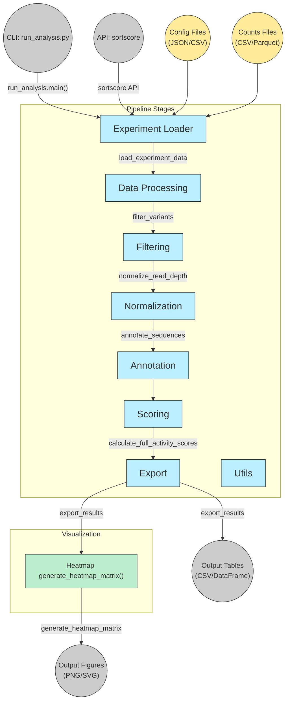

# sortscore
[Documentation Index](docs/index.md)

## Installation

```bash
pip install git+https://github.com/dbaldridge-lab/sortscore.git
```

## Usage

```bash
sortscore --config path/to/config.json
```

## Testing and Development

See [CONTRIBUTING.md](CONTRIBUTING.md) for instructions on:
- Installing from a cloned repository
- Running tests with example fixtures
- Using the package in Jupyter notebooks
- Python API examples

## Config Templates

Example configuration files:
- `config/example_experiment.json` - Experiment configuration template
- `config/experiment_setup.csv` - Experiment setup CSV template

## System Requirements

- Python 3.10+
- See `requirements.txt` for dependencies



## License
MIT
