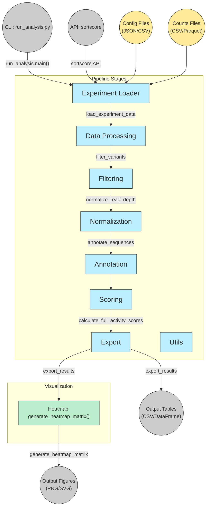

# sortscore
[Documentation Index](docs/index.md)

## Installation
#TODO: Update this when released on PYPI #1
**Option 1: Using a virtual environment (recommended)**

The following are bash commands:
```bash
# Create and activate a virtual environment
python -m venv .venv
source .venv/bin/activate  # On Windows: .venv\Scripts\activate

# Install sortscore
git clone git+https://github.com/dbaldridge-lab/sortscore.git
cd sortscore
pip install -e .
```

**Option 2: Using conda/anaconda**

```bash
# Activate your conda environment
conda activate your-env-name

# Verify you're using conda's pip
which pip  # Should show path to conda environment

# Install sortscore
git clone git+https://github.com/dbaldridge-lab/sortscore.git
cd sortscore
pip install -e .
```

**Option 3: Install directly (may require adding scripts directory to PATH)**

```bash
# Install sortscore
git clone git+https://github.com/dbaldridge-lab/sortscore.git
cd sortscore
pip install -e .
```

## Usage
### Scoring
With virtual environment or conda environment activated:
```bash
# only required arguements
sortscore -n EXPERIMENT_NAME -e experiment_config.csv -w WT_SEQ
```

Otherwise, add `python -m` before the sortscore command (or `python3 -m`, depending on your python installation).

```bash
python -m sortscore ...
```

### Tile Normalization

```bash
# Including optional -c option and batch config file
sortscore -b -n EXPERIMENT_NAME -e experiment_config.csv -c batch_config.json
```

## Config Templates

[config.json](https://github.com/dbaldridge-lab/sortscore/blob/main/tests/fixtures/GLI2_oPool5b/config.json)
- define additional parameters impacting the analysis execution and outputs

[experiment_setup.csv](https://github.com/dbaldridge-lab/sortscore/blob/main/tests/fixtures/GLI2_oPool5b/experiment_setup.csv)
- define replicates and bins for each sample
- provide parameters for each sample (MFI, cell counts, etc.)

`batch_config.json`

## System Requirements

- Python 3.10+
- See `requirements.txt` for dependencies

## Troubleshooting
If you encounter any issues during installation:

Ensure you're using Python 3.10 or higher: `python --version`
Try updating pip: `pip install --upgrade pip`
For dependency conflicts, consider using a virtual environment `python -m venv .venv && source .venv/bin/activate`.



## License
MIT
