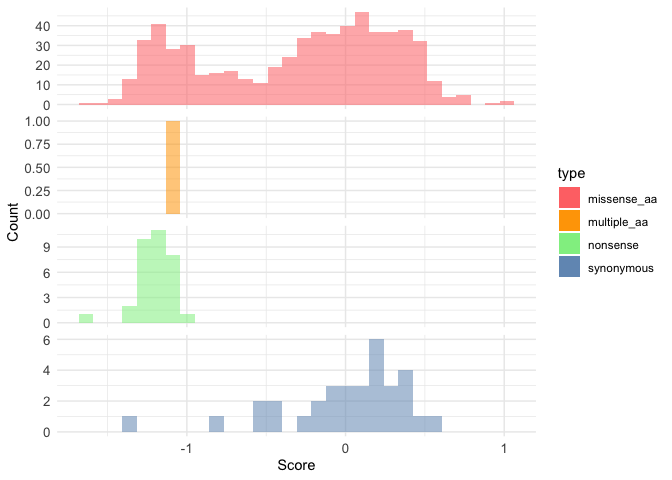
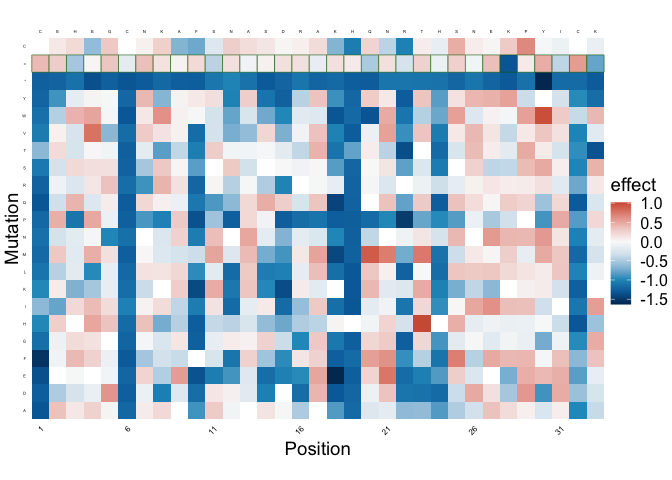

# Lilace Scoring Demo


- [Use sortscore Output as Lilace
  Input](#use-sortscore-output-as-lilace-input)
  - [Parameters](#parameters)
  - [Installation](#installation)
  - [Setup](#setup)
  - [Generate Input File](#generate-input-file)
    - [Use sortscore output to get Lilace input
      counts](#use-sortscore-output-to-get-lilace-input-counts)
    - [Load input counts](#load-input-counts)
    - [Prepare counts for Lilace](#prepare-counts-for-lilace)
  - [Run Lilace](#run-lilace)

# Use sortscore Output as Lilace Input

The code in this notebook is adapted from the Lilace vignette to
demonstrate how to utilize sortscore output as an input for this
workflow.

Cite: Freudenberg, J., Rao, J., Howard, M. K., Macdonald, C., Greenwald,
N. F., Coyote-Maestas, W., & Pimentel, H. (2026). Accurate variant
effect estimation in FACS-based deep mutational scanning data with
Lilace. Genome Biology, 27(1), 48.
https://doi.org/10.1186/s13059-026-03934-1

Reference vignette: [Introduction to
Lilace](https://pimentellab.com/lilace/articles/intro.html).

0.  The `sortscore integrate` command is used to return a Lilace-ready
    counts table.
1.  Import scores and metadata from sortscore into Lilace’s input
    format.
2.  Normalize according to cell sorting percentages, if needed.
3.  Run Lilace.
4.  Review the output scores.

## Parameters

Edit these values before running the analysis for a new dataset.

``` r
# Paths below are repo-relative unless you provide an absolute path.
counts_path <- "demo_data/external_tools/Lilace_input_counts.csv"
working_dir <- "demo_data/external_tools/Lilace"
input_scores_path <- "demo_data/_test_outputs/multitile_output/normalized/zscore_2pole/scores/batch_aa_scores.csv"

# Optional filter for tiled experiments. Set to NULL to include all batches.
batch_name <- "tile1"

# Export type for `sortscore integrate lilace`.
mutagenesis_type <- "aa" # set to "codon" for dna score tables

sortscore_python <- "venv/bin/python" # path to an interpreter with sortscore installed

# Set to TRUE if you want Lilace counts normalized to sorting proportions.
use_sort_normalization <- FALSE

# Sorting proportions aligned to the integrated Lilace count columns (`c_0`, `c_1`, ...).
sort_prop_values <- c(0.25, 0.25, 0.25, 0.25)

control_label <- "synonymous"
n_parallel_chains <- 4
seed <- 1
```

## Installation

The Lilace vignette recommends installing `cmdstanr` first, then
`CmdStan`, and finally Lilace itself.

## Setup

Once the remaining required packages are installed, load them in the
setup chunk below.

## Generate Input File

### Use sortscore output to get Lilace input counts

Generates the Lilace input counts file from a sortscore scores table.

``` r
integrate_args <- c(
  "-m", "sortscore", "integrate", "lilace",
  "--input", here::here(input_scores_path),
  "--output", here::here(counts_path),
  "--mutagenesis-type", mutagenesis_type
)

if (!is.null(batch_name) && nzchar(batch_name)) {
  integrate_args <- c(integrate_args, "--batch", batch_name)
}

sortscore_python_path <- if (grepl("^(/|~)", sortscore_python)) {
  path.expand(sortscore_python)
} else {
  here::here(sortscore_python)
}

system2(sortscore_python_path, integrate_args)
```

### Load input counts

The `sortscore integrate lilace` preprocessing step produces one row per
variant per replicate, including `variant_id`, `mutation_type`,
`position`, and Lilace count columns corresponding to the FACS bins.

``` r
counts_file <- here::here(counts_path)
working_dir_path <- here::here(working_dir)

raw_counts <- readr::read_csv(counts_file, show_col_types = FALSE)

dplyr::glimpse(raw_counts)
```

    Rows: 2,082
    Columns: 10
    $ variant_id             <chr> "A.13.*", "A.13.*", "A.13.*", "A.13.=", "A.13.=…
    $ mutation_type          <chr> "nonsense", "nonsense", "nonsense", "synonymous…
    $ position               <dbl> 13, 13, 13, 13, 13, 13, 13, 13, 13, 13, 13, 13,…
    $ replicate              <dbl> 1, 2, 3, 1, 2, 3, 1, 2, 3, 1, 2, 3, 1, 2, 3, 1,…
    $ c_0                    <dbl> 15720.333, 13544.333, 15262.333, 33309.000, 294…
    $ c_1                    <dbl> 12245.67, 15619.33, 12997.33, 15224.33, 22059.0…
    $ c_2                    <dbl> 5370.333, 8239.667, 8628.333, 41120.000, 49818.…
    $ c_3                    <dbl> 993.000, 1856.000, 875.000, 57926.333, 66240.66…
    $ sortscore_score        <dbl> -3.94801452, -3.94801452, -3.94801452, -0.54142…
    $ sortscore_score_column <chr> "avgscore", "avgscore", "avgscore", "avgscore",…

``` r
head(raw_counts)
```

    # A tibble: 6 × 10
      variant_id mutation_type position replicate    c_0    c_1    c_2    c_3
      <chr>      <chr>            <dbl>     <dbl>  <dbl>  <dbl>  <dbl>  <dbl>
    1 A.13.*     nonsense            13         1 15720. 12246.  5370.   993 
    2 A.13.*     nonsense            13         2 13544. 15619.  8240.  1856 
    3 A.13.*     nonsense            13         3 15262. 12997.  8628.   875 
    4 A.13.=     synonymous          13         1 33309  15224. 41120  57926.
    5 A.13.=     synonymous          13         2 29453. 22059  49818. 66241.
    6 A.13.=     synonymous          13         3 27462. 22446  42555  68662.
    # ℹ 2 more variables: sortscore_score <dbl>, sortscore_score_column <chr>

### Prepare counts for Lilace

The integrated input file already includes Lilace’s `variant_id`,
`mutation_type`, `position`, `replicate`, and `c_0`, `c_1`, … count
columns. The step below detects those count columns and separates any
extra metadata.

``` r
stopifnot(all(c("variant_id", "mutation_type", "position", "replicate") %in% names(raw_counts)))

count_col_names <- names(raw_counts)[grepl("^c_[0-9]+$", names(raw_counts))]
stopifnot(length(count_col_names) > 0)

lilace_counts <- raw_counts |>
  dplyr::select(
    variant_id,
    mutation_type,
    position,
    replicate,
    dplyr::all_of(count_col_names)
  )

lilace_counts[count_col_names] <- lapply(
  lilace_counts[count_col_names],
  function(col) as.integer(round(col))
)

metadata_cols <- raw_counts |>
  dplyr::select(-replicate, -dplyr::all_of(count_col_names))

lilace_counts |>
  dplyr::arrange(position, variant_id, replicate) |>
  head()
```

    # A tibble: 6 × 8
      variant_id mutation_type position replicate   c_0   c_1   c_2   c_3
      <chr>      <chr>            <dbl>     <dbl> <int> <int> <int> <int>
    1 C.1.*      nonsense             1         1 57583 47141 13450  2849
    2 C.1.*      nonsense             1         2 52358 51908 27760  4763
    3 C.1.*      nonsense             1         3 57326 47453 25291  1790
    4 C.1.=      synonymous           1         1  1683  1051  2910 10219
    5 C.1.=      synonymous           1         2  1404  1545  5604  7472
    6 C.1.=      synonymous           1         3  1520  1085  5148 12823

``` r
metadata_cols |>
  dplyr::arrange(position, variant_id) |>
  head()
```

    # A tibble: 6 × 5
      variant_id mutation_type position sortscore_score sortscore_score_column
      <chr>      <chr>            <dbl>           <dbl> <chr>                 
    1 C.1.*      nonsense             1           -3.90 avgscore              
    2 C.1.*      nonsense             1           -3.90 avgscore              
    3 C.1.*      nonsense             1           -3.90 avgscore              
    4 C.1.=      synonymous           1            1.39 avgscore              
    5 C.1.=      synonymous           1            1.39 avgscore              
    6 C.1.=      synonymous           1            1.39 avgscore              

Convert the counts table into a Lilace object.

``` r
lilace_obj <- lilace::lilace_from_counts(
  variant_id = lilace_counts$variant_id,
  mutation_type = lilace_counts$mutation_type,
  position = lilace_counts$position,
  replicate = lilace_counts$replicate,
  counts = lilace_counts |> dplyr::select(dplyr::all_of(count_col_names)),
  metadata = metadata_cols
)

head(lilace_obj$data)
```

    # A tibble: 6 × 15
      variant variant_id mutation_type position sortscore_score
      <chr>   <chr>      <chr>            <dbl>           <dbl>
    1 C.1.*   C.1.*      nonsense             1           -3.90
    2 C.1.*   C.1.*      nonsense             1           -3.90
    3 C.1.*   C.1.*      nonsense             1           -3.90
    4 C.1.=   C.1.=      synonymous           1            1.39
    5 C.1.=   C.1.=      synonymous           1            1.39
    6 C.1.=   C.1.=      synonymous           1            1.39
    # ℹ 10 more variables: sortscore_score_column <chr>, type <chr>,
    #   position.1 <dbl>, rep <dbl>, c_0 <int>, c_1 <int>, c_2 <int>, c_3 <int>,
    #   n_counts <dbl>, total_counts <dbl>

## Run Lilace

Optionally normalize to the FACS sorting proportions.

``` r
if (use_sort_normalization) {
  stopifnot(length(sort_prop_values) == length(count_col_names))
  sort_props <- stats::setNames(sort_prop_values, count_col_names)

  lilace_obj <- lilace::lilace_sorting_normalize(
    lilace_obj,
    sort_props,
    rep_specific = FALSE
  )
}

if (use_sort_normalization) {
  head(lilace_obj$normalized_data)
}
```

Fit the Lilace model. Per the Lilace vignette, synonymous variants are
used as the negative control group by default.

``` r
lilace_obj <- lilace::lilace_fit_model(
  lilace_obj,
  output_dir = working_dir_path,
  control_label = control_label,
  control_correction = TRUE,
  use_positions = TRUE,
  pseudocount = TRUE,
  n_parallel_chains = n_parallel_chains,
  seed = seed
)
```

    Running Lilace on input counts

    Init values were only set for a subset of parameters. 
    Missing init values for the following parameters:
     - chain 1: q, sigma_syn, theta, z, theta_syn, a, b
     - chain 2: q, sigma_syn, theta, z, theta_syn, a, b
     - chain 3: q, sigma_syn, theta, z, theta_syn, a, b
     - chain 4: q, sigma_syn, theta, z, theta_syn, a, b

    To disable this message use options(cmdstanr_warn_inits = FALSE).

    Running MCMC with 4 parallel chains...

    Chain 1 Iteration:    1 / 2000 [  0%]  (Warmup) 

    Chain 2 Rejecting initial value:

    Chain 2   Log probability evaluates to log(0), i.e. negative infinity.

    Chain 2   Stan can't start sampling from this initial value.

    Chain 2 Iteration:    1 / 2000 [  0%]  (Warmup) 
    Chain 3 Iteration:    1 / 2000 [  0%]  (Warmup) 
    Chain 4 Iteration:    1 / 2000 [  0%]  (Warmup) 
    Chain 4 Iteration:  250 / 2000 [ 12%]  (Warmup) 
    Chain 1 Iteration:  250 / 2000 [ 12%]  (Warmup) 
    Chain 3 Iteration:  250 / 2000 [ 12%]  (Warmup) 
    Chain 2 Iteration:  250 / 2000 [ 12%]  (Warmup) 
    Chain 4 Iteration:  500 / 2000 [ 25%]  (Warmup) 
    Chain 3 Iteration:  500 / 2000 [ 25%]  (Warmup) 
    Chain 1 Iteration:  500 / 2000 [ 25%]  (Warmup) 
    Chain 2 Iteration:  500 / 2000 [ 25%]  (Warmup) 
    Chain 4 Iteration:  750 / 2000 [ 37%]  (Warmup) 
    Chain 1 Iteration:  750 / 2000 [ 37%]  (Warmup) 
    Chain 2 Iteration:  750 / 2000 [ 37%]  (Warmup) 
    Chain 3 Iteration:  750 / 2000 [ 37%]  (Warmup) 
    Chain 1 Iteration: 1000 / 2000 [ 50%]  (Warmup) 
    Chain 1 Iteration: 1001 / 2000 [ 50%]  (Sampling) 
    Chain 4 Iteration: 1000 / 2000 [ 50%]  (Warmup) 
    Chain 4 Iteration: 1001 / 2000 [ 50%]  (Sampling) 
    Chain 2 Iteration: 1000 / 2000 [ 50%]  (Warmup) 
    Chain 2 Iteration: 1001 / 2000 [ 50%]  (Sampling) 
    Chain 3 Iteration: 1000 / 2000 [ 50%]  (Warmup) 
    Chain 3 Iteration: 1001 / 2000 [ 50%]  (Sampling) 
    Chain 4 Iteration: 1250 / 2000 [ 62%]  (Sampling) 
    Chain 3 Iteration: 1250 / 2000 [ 62%]  (Sampling) 
    Chain 4 Iteration: 1500 / 2000 [ 75%]  (Sampling) 
    Chain 3 Iteration: 1500 / 2000 [ 75%]  (Sampling) 
    Chain 4 Iteration: 1750 / 2000 [ 87%]  (Sampling) 
    Chain 3 Iteration: 1750 / 2000 [ 87%]  (Sampling) 
    Chain 4 Iteration: 2000 / 2000 [100%]  (Sampling) 
    Chain 4 finished in 191.6 seconds.
    Chain 3 Iteration: 2000 / 2000 [100%]  (Sampling) 
    Chain 3 finished in 194.3 seconds.
    Chain 1 Iteration: 1250 / 2000 [ 62%]  (Sampling) 
    Chain 2 Iteration: 1250 / 2000 [ 62%]  (Sampling) 
    Chain 1 Iteration: 1500 / 2000 [ 75%]  (Sampling) 
    Chain 2 Iteration: 1500 / 2000 [ 75%]  (Sampling) 
    Chain 1 Iteration: 1750 / 2000 [ 87%]  (Sampling) 
    Chain 1 Iteration: 2000 / 2000 [100%]  (Sampling) 
    Chain 1 finished in 307.5 seconds.
    Chain 2 Iteration: 1750 / 2000 [ 87%]  (Sampling) 
    Chain 2 Iteration: 2000 / 2000 [100%]  (Sampling) 
    Chain 2 finished in 382.3 seconds.

    All 4 chains finished successfully.
    Mean chain execution time: 268.9 seconds.
    Total execution time: 382.4 seconds.

    Warning: 1 of 4000 (0.0%) transitions hit the maximum treedepth limit of 10.
    See https://mc-stan.org/misc/warnings for details.

    Warning: 1 of 4000 (0.0%) transitions hit the maximum treedepth limit of 10.
    See https://mc-stan.org/misc/warnings for details.

    Joining with `by = join_by(p_map)`
    Joining with `by = join_by(map)`
    Joining with `by = join_by(variant, rep)`

Read the exported scores table.

``` r
scores <- readr::read_tsv(
  file.path(working_dir_path, "lilace_output", "variant_scores.tsv"),
  show_col_types = FALSE
)

head(scores)
```

    # A tibble: 6 × 13
      variant type        variant_id mutation_type position sortscore_score
      <chr>   <chr>       <chr>      <chr>            <dbl>           <dbl>
    1 C.1.A   missense_aa C.1.A      missense_aa          1           -4.20
    2 C.1.D   missense_aa C.1.D      missense_aa          1           -4.00
    3 C.1.E   missense_aa C.1.E      missense_aa          1           -4.17
    4 C.1.F   missense_aa C.1.F      missense_aa          1           -3.93
    5 C.1.G   missense_aa C.1.G      missense_aa          1           -3.66
    6 C.1.H   missense_aa C.1.H      missense_aa          1           -3.95
    # ℹ 7 more variables: sortscore_score_column <chr>, effect <dbl>,
    #   effect_se <dbl>, lfsr <dbl>, pos_mean <dbl>, pos_sd <dbl>,
    #   discovery05 <dbl>

Basic summary views.

``` r
scores |>
  dplyr::count(type, sort = TRUE)
```

    # A tibble: 4 × 2
      type            n
      <chr>       <int>
    1 missense_aa   627
    2 nonsense       33
    3 synonymous     33
    4 multiple_aa     1

``` r
scores |>
  dplyr::arrange(lfsr, dplyr::desc(abs(effect))) %>%
  dplyr::select(variant, type, position, effect, effect_se, lfsr, discovery05) %>%
  head(20)
```

    # A tibble: 20 × 7
       variant type        position effect effect_se    lfsr discovery05
       <chr>   <chr>          <dbl>  <dbl>     <dbl>   <dbl>       <dbl>
     1 K.18.E  missense_aa       18 -1.64      0.421 0                -1
     2 Y.30.W  missense_aa       30  0.978     0.418 0                 1
     3 T.23.H  missense_aa       23  1.02      0.415 0.00025           1
     4 Q.20.M  missense_aa       20  0.906     0.409 0.00025           1
     5 Y.30.*  nonsense          30 -1.63      0.411 0.0005           -1
     6 C.1.F   missense_aa        1 -1.54      0.421 0.0005           -1
     7 R.22.P  missense_aa       22 -1.49      0.423 0.0035           -1
     8 E.4.V   missense_aa        4  0.780     0.407 0.0035            1
     9 K.18.M  missense_aa       18 -1.41      0.409 0.00625          -1
    10 N.21.E  missense_aa       21  0.765     0.423 0.0065            1
    11 T.23.M  missense_aa       23  0.744     0.414 0.007             1
    12 D.15.K  missense_aa       15 -1.38      0.396 0.008            -1
    13 N.21.M  missense_aa       21  0.731     0.419 0.008             1
    14 K.18.Q  missense_aa       18 -1.43      0.421 0.009            -1
    15 S.25.F  missense_aa       25  0.715     0.411 0.009             1
    16 F.10.K  missense_aa       10 -1.39      0.411 0.0095           -1
    17 E.4.*   nonsense           4 -1.35      0.420 0.0115           -1
    18 F.10.P  missense_aa       10 -1.35      0.411 0.0115           -1
    19 R.22.T  missense_aa       22 -1.37      0.417 0.0118           -1
    20 K.33.T  missense_aa       33 -1.34      0.415 0.0118           -1

Optional diagnostic plots from Lilace.

``` r
lilace::lilace_score_density(
  scores,
  savedir = working_dir_path,
  score.col = "effect",
  name = "score_histogram",
  hist = TRUE,
  scale.free = TRUE
)
```



``` r
heatmap_scores <- scores |>
  dplyr::mutate(
    wildtype = stringr::str_extract(variant, "^[^.]+"),
    mutation = stringr::str_extract(variant, "[^.]+$")
  )

lilace::lilace_score_heatmap(
  heatmap_scores,
  savedir = working_dir_path,
  score.col = "effect",
  name = "score_heatmap"
)
```


